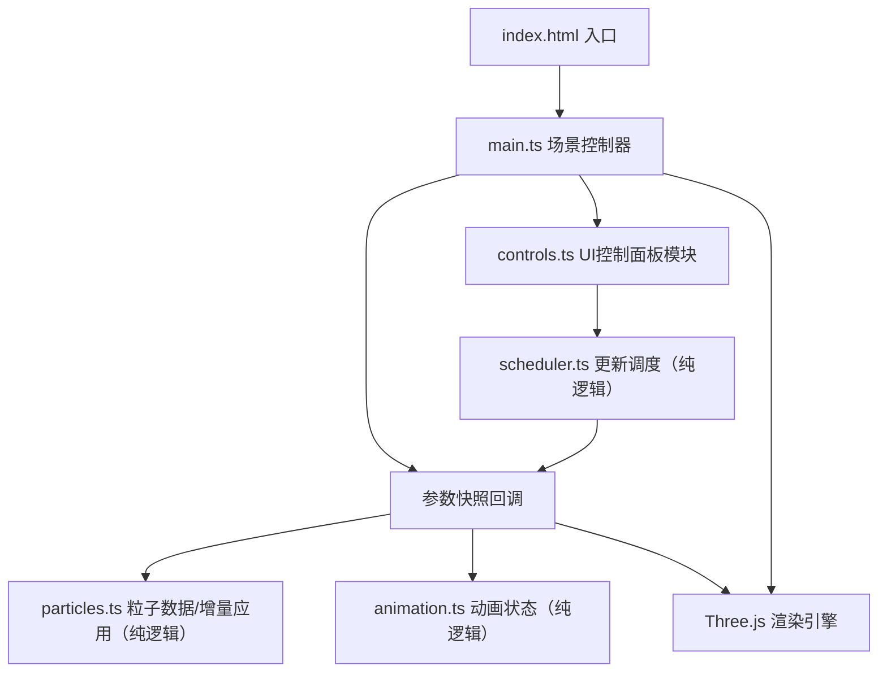

## 1. 架构设计
纯前端3D应用，采用模块化架构，分离场景管理、粒子系统和UI控制。



分层说明：`params.ts` / `particles.ts` / `animation.ts` / `scheduler.ts` 为不依赖 Three.js 与 DOM 的纯逻辑层，可在 Node 中离线验证（`npm run verify`）；`nebula.ts` 仅负责 Three.js 对象装配，`main.ts` 仅负责渲染循环与相机。

## 2. 技术描述
- **前端框架**：原生 TypeScript + Three.js（不使用React/Vue，按用户要求最小化依赖）
- **构建工具**：Vite 5.x，启用ES模块和TypeScript支持
- **核心依赖**：
  - `three`：^0.160.0，3D渲染引擎
  - `@types/three`：^0.160.0，TypeScript类型定义
  - `typescript`：^5.3.0，类型系统
  - `vite`：^5.0.0，构建开发服务器

## 3. 项目文件结构
| 文件路径 | 职责 |
|----------|------|
| `package.json` | 项目依赖、启动脚本（`npm run dev`） |
| `vite.config.js` | Vite配置，ES模块 + TypeScript |
| `tsconfig.json` | TypeScript严格模式，ESNext模块解析 |
| `index.html` | 入口页面，全屏Canvas，深空渐变背景 |
| `src/main.ts` | 场景/相机/渲染器初始化，渲染循环，相机自动旋转 |
| `src/nebula.ts` | Three.js 装配层：几何体/材质创建、增量更新标记、销毁 |
| `src/controls.ts` | 右侧控制面板DOM创建，滑块事件监听，接入更新调度器 |
| `src/params.ts` | 参数快照类型、比较与差异计算（纯逻辑） |
| `src/particles.ts` | 粒子基础数据生成（种子随机）与按参数增量计算缓冲（纯逻辑） |
| `src/animation.ts` | 动画状态（旋转角、时间）推进，独立于参数快照（纯逻辑） |
| `src/scheduler.ts` | 参数更新调度：帧内合并、去重、防丢失（纯逻辑） |
| `scripts/verify-offline.ts` | 离线验证：顺序无关性、增量隔离、调度行为、动画独立性 |

## 4. 核心模块API定义

### 4.1 Nebula 模块
```typescript
export interface NebulaParams {
  particleCount: number;    // 1000-10000
  hueOffset: number;        // 0-360度
  radius: number;           // 5-20单位
  rotationSpeed: number;    // 0-2弧度/秒
}

export function createNebula(params: NebulaParams): THREE.Points;
export function updateNebula(points: THREE.Points, params: NebulaParams): void;
export function disposeNebula(points: THREE.Points): void;
```

### 4.2 Controls 模块
```typescript
export interface ControlChangeHandler {
  (params: NebulaParams): void;
}

export function createControls(
  container: HTMLElement,
  initialParams: NebulaParams,
  onChange: ControlChangeHandler
): void;
```

## 5. 粒子生成算法
- **分布方式**：球壳分布，使用球坐标系随机生成，半径范围 `[radius*0.7, radius]`
- **颜色映射**：根据粒子到中心的距离进行HSL插值，中心 `hsl(20, 100%, 60%)` → 外围 `hsl(250, 80%, 50%)`，叠加色相偏移
- **透明度**：随机 `0.3-1.0`，存储在 `BufferAttribute`
- **大小**：随机 `0.05-0.5` 单位，存储在 `BufferAttribute`
- **更新策略**：参数变化时仅增量更新受影响的 `BufferAttribute`（色相→颜色、半径→位置、数量→drawRange、旋转速度→无缓冲操作），不重建几何体；位置/颜色始终由不可变基础数据与当前参数纯函数计算，与调整顺序无关
- **动画透明度波动**：基础透明度存于静态属性，波动在顶点着色器中由 `uTime` uniform 计算，不再每帧回写 CPU 缓冲

## 6. 性能优化策略
1. **单个Points对象**：所有粒子使用单个BufferGeometry + PointsMaterial，减少Draw Call
2. **AdditiveBlending**：加法混合，无需深度写入，提升透明渲染性能
3. **BufferGeometry复用**：更新参数时仅更新attribute数组，不重建几何体
4. **requestAnimationFrame**：渲染循环与浏览器刷新率同步，使用`Clock.getDelta()`实现帧率无关动画
5. **节流更新**：滑块事件使用`requestAnimationFrame`节流，避免高频重建
6. **圆形精灵贴图**：使用Canvas生成软边缘圆形贴图，替代`sizeAttenuation`减少Shader计算
