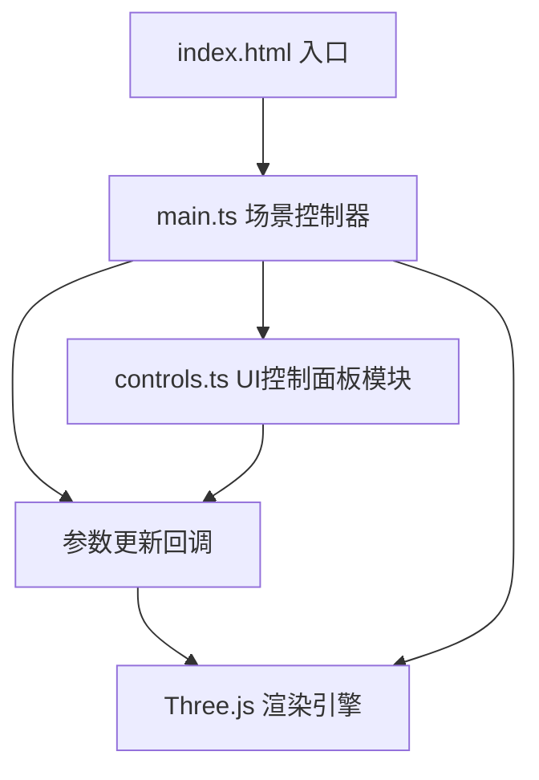

## 1. 架构设计
纯前端3D应用，采用模块化架构，分离场景管理、粒子系统和UI控制。



## 2. 技术描述
- **前端框架**：原生 TypeScript + Three.js（不使用React/Vue，按用户要求最小化依赖）
- **构建工具**：Vite 5.x，启用ES模块和TypeScript支持
- **核心依赖**：
  - `three`：^0.160.0，3D渲染引擎
  - `@types/three`：^0.160.0，TypeScript类型定义
  - `typescript`：^5.3.0，类型系统
  - `vite`：^5.0.0，构建开发服务器

## 3. 项目文件结构
| 文件路径 | 职责 |
|----------|------|
| `package.json` | 项目依赖、启动脚本（`npm run dev`） |
| `vite.config.js` | Vite配置，ES模块 + TypeScript |
| `tsconfig.json` | TypeScript严格模式，ESNext模块解析 |
| `index.html` | 入口页面，全屏Canvas，深空渐变背景 |
| `src/main.ts` | 场景/相机/渲染器初始化，渲染循环，相机自动旋转 |
| `src/nebula/params.ts` | 参数快照类型与增量 diff |
| `src/nebula/seeds.ts` | 粒子随机种子（与参数解耦，可注入确定性随机源） |
| `src/nebula/derive.ts` | 纯函数派生：位置/颜色/大小 = f(种子, 参数) |
| `src/nebula/model.ts` | 粒子模型：持有种子与参数快照，输出派生数据 |
| `src/nebula/animation.ts` | 动画状态（旋转角、时间），独立于参数快照 |
| `src/nebula/renderer.ts` | Three.js 适配器：几何体复用、增量缓冲区写入、uniform 驱动动画 |
| `src/nebula/scheduler.ts` | 参数更新调度：rAF 合帧 + flush，去重不丢更新 |
| `src/controls.ts` | 右侧控制面板DOM创建，滑块事件经调度器提交 |
| `tests/` | 离线验证（node:test，无需浏览器/GPU），`npm test` 运行 |

## 4. 核心模块API定义

### 4.1 Nebula 模块
```typescript
export interface NebulaParams {
  particleCount: number;    // 1000-10000
  hueOffset: number;        // 0-360度
  radius: number;           // 5-20单位
  rotationSpeed: number;    // 0-2弧度/秒
}

export class NebulaModel {
  setParams(next: NebulaParams): NebulaParamKey[];  // 返回变化的参数键
  positionAt(index: number): Vec3;                  // 纯派生，顺序无关
  colorAt(index: number): Vec3;
}

export class NebulaRenderer {
  readonly points: THREE.Points;
  applyParams(next: NebulaParams): void;  // 仅重写受影响缓冲区区间
  tick(delta: number): void;              // 动画推进，只写 rotation/uTime uniform
  dispose(): void;
}

export function createParamScheduler(
  onCommit: (params: NebulaParams) => void,
  schedule?: ScheduleFn
): ParamScheduler;  // push() 合帧去重，flush() 保证最终值不丢失
```

### 4.2 Controls 模块
```typescript
export interface ControlChangeHandler {
  (params: NebulaParams): void;
}

export function createControls(
  container: HTMLElement,
  initialParams: NebulaParams,
  onChange: ControlChangeHandler
): void;
```

## 5. 粒子生成算法
- **分布方式**：球壳分布，使用球坐标系随机生成，半径范围 `[radius*0.7, radius]`
- **颜色映射**：根据粒子到中心的距离进行HSL插值，中心 `hsl(20, 100%, 60%)` → 外围 `hsl(250, 80%, 50%)`，叠加色相偏移
- **透明度**：随机 `0.3-1.0`，存储在 `BufferAttribute`
- **大小**：随机 `0.05-0.5` 单位，存储在 `BufferAttribute`
- **更新策略**：参数变化时仅增量更新受影响的 `BufferAttribute` 区间（位置/颜色由种子+参数纯派生，半径往返无漂移），不重建几何体，保证平滑过渡和30fps+性能
- **动画策略**：透明度波动在顶点着色器中由 `uTime` uniform 计算，渲染循环不再每帧回写 alpha 缓冲区；动画状态（旋转角/时间）独立于参数快照

## 6. 性能优化策略
1. **单个Points对象**：所有粒子使用单个BufferGeometry + PointsMaterial，减少Draw Call
2. **AdditiveBlending**：加法混合，无需深度写入，提升透明渲染性能
3. **BufferGeometry复用**：更新参数时仅更新attribute数组，不重建几何体
4. **requestAnimationFrame**：渲染循环与浏览器刷新率同步，使用`Clock.getDelta()`实现帧率无关动画
5. **节流更新**：滑块事件使用`requestAnimationFrame`节流，避免高频重建
6. **圆形精灵贴图**：使用Canvas生成软边缘圆形贴图，替代`sizeAttenuation`减少Shader计算
